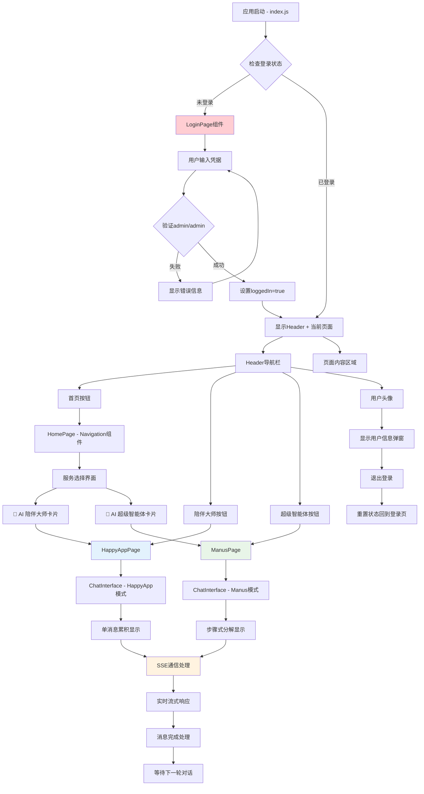
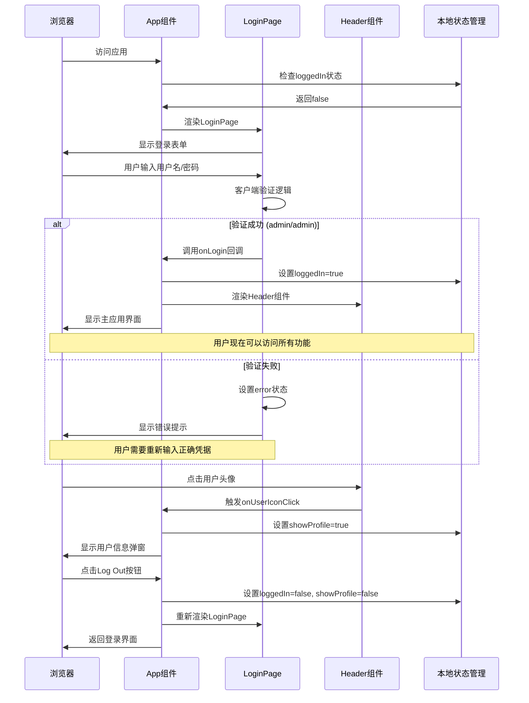
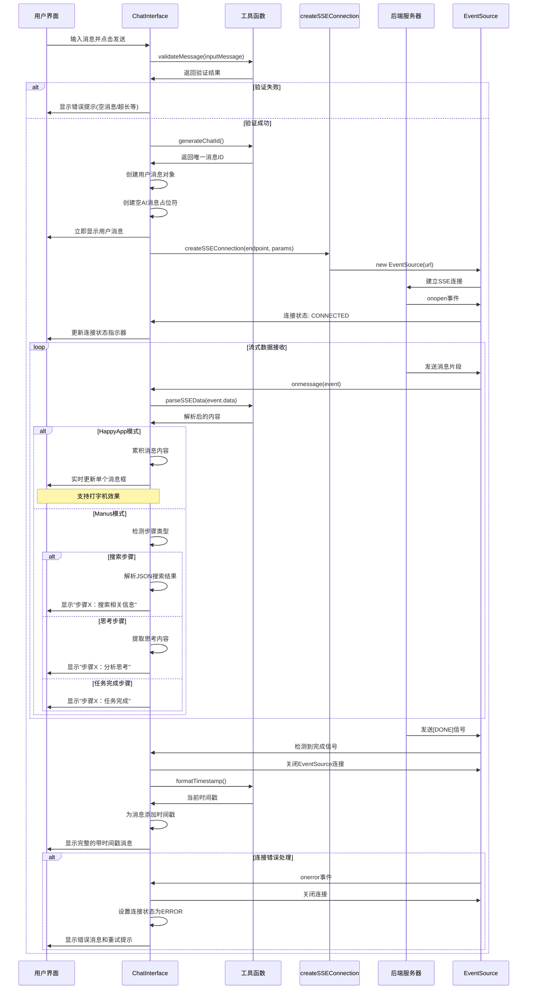
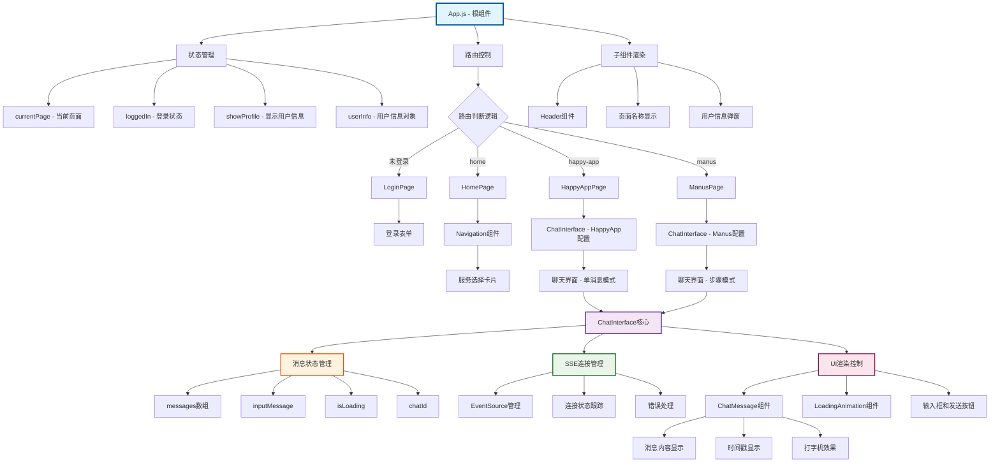
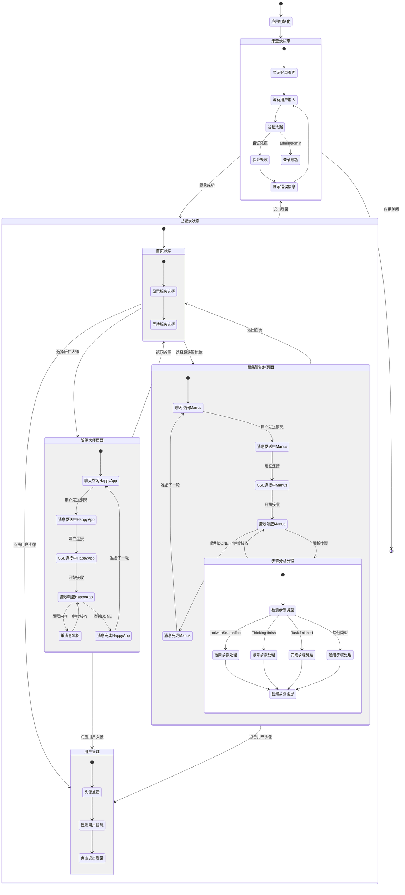
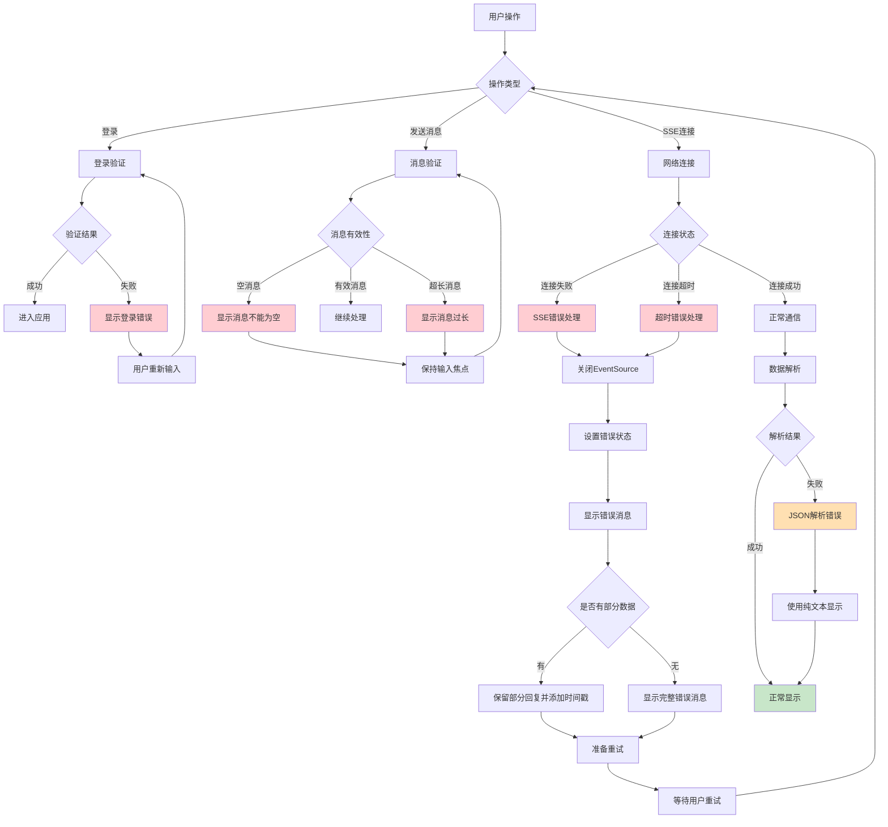
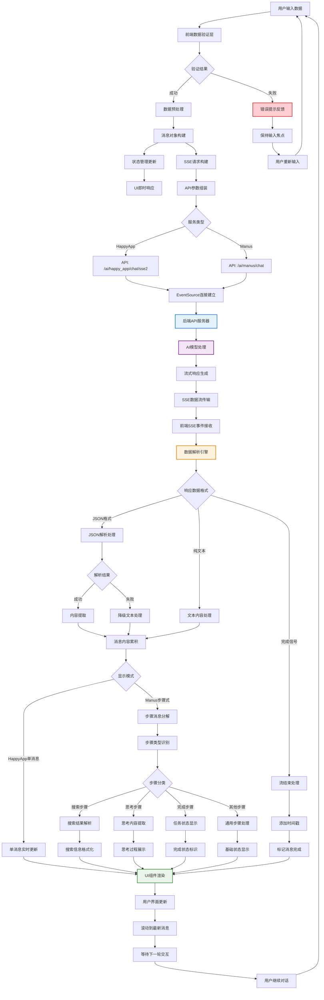
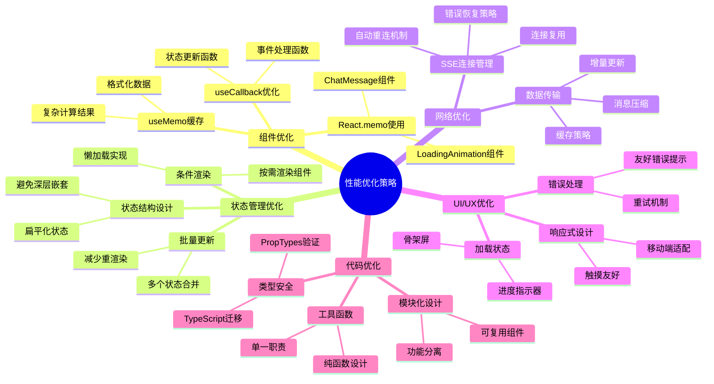

# AI聊天应用项目流程图文档

## 项目概述

这是一个基于React的AI聊天应用，包含两个主要服务：
- **陪伴大师** (HappyApp) - 智能对话陪伴服务，使用单消息累积模式
- **超级智能体** (Manus) - 高级智能助手服务，使用步骤式处理模式

应用使用Server-Sent Events (SSE) 技术实现实时流式对话，支持错误处理、重连机制和多种消息显示模式。

---

## 1. 整体应用架构流程图



---

## 2. 用户认证与会话管理流程



---

## 3. SSE聊天通信详细流程



---

## 4. 组件层次结构与数据流



---

## 5. 状态管理生命周期



---

## 6. 错误处理与异常流程



---

## 7. 数据流与API交互



---

## 8. 项目文件结构与模块依赖

```mermaid
graph TD
    A[src/] --> B[index.js 应用入口]
    A --> C[App.js 根组件]
    A --> D[pages/ 页面组件]
    A --> E[components/ 通用组件]
    A --> F[utils/ 工具模块]
    A --> G[styles/ 样式文件]
    
    B --> H[React.StrictMode]
    B --> I[ReactDOM.render]
    H --> C
    
    C --> J[状态管理 - useState Hook]
    C --> K[条件渲染逻辑]
    C --> L[全局用户信息管理]
    
    D --> M[LoginPage.js]
    D --> N[HomePage.js] 
    D --> O[HappyAppPage.js]
    D --> P[ManusPage.js]
    
    E --> Q[Header.js 顶部导航]
    E --> R[Navigation.js 服务选择]
    E --> S[ChatInterface.js 聊天核心]
    E --> T[ChatMessage.js 消息显示]
    E --> U[LoadingAnimation.js 加载动画]
    
    F --> V[api.js API配置]
    F --> W[helpers.js 工具函数]
    
    G --> X[globals.css 全局样式]
    G --> Y[App.css 组件样式]
    
    M --> Z[表单验证逻辑]
    M --> AA[错误状态管理]
    
    N --> R
    O --> S
    P --> S
    
    Q --> BB[导航状态管理]
    Q --> CC[用户信息显示]
    
    S --> DD[消息状态管理]
    S --> EE[SSE连接管理]
    S --> FF[错误处理机制]
    S --> T
    S --> U
    
    T --> GG[消息渲染逻辑]
    T --> HH[时间戳格式化]
    T --> II[打字机效果]
    
    V --> JJ[SSE连接创建]
    V --> KK[API端点配置]
    V --> LL[连接状态常量]
    
    W --> MM[ID生成器]
    W --> NN[时间格式化]
    W --> OO[消息验证]
    W --> PP[SSE数据解析]
    W --> QQ[UI滚动控制]
    
    X --> RR[CSS变量定义]
    X --> SS[响应式设计]
    X --> TT[动画效果]
    X --> UU[主题样式]
    
    style C fill:#e1f5fe,stroke:#01579b,stroke-width:3px
    style S fill:#f3e5f5,stroke:#4a148c,stroke-width:3px
    style V fill:#fff3e0,stroke:#e65100,stroke-width:2px
    style W fill:#e8f5e8,stroke:#1b5e20,stroke-width:2px
    style X fill:#fce4ec,stroke:#880e4f,stroke-width:2px
```



---

## 9. 性能优化与最佳实践



---

## 10. 部署与运维流程

```mermaid
gitgraph
    commit id: "项目初始化"
    branch development
    checkout development
    commit id: "登录功能开发"
    commit id: "聊天界面开发"
    commit id: "SSE集成"
    
    branch feature/happy-app
    checkout feature/happy-app
    commit id: "陪伴大师功能"
    commit id: "单消息模式"
    
    checkout development
    merge feature/happy-app
    
    branch feature/manus
    checkout feature/manus
    commit id: "超级智能体功能"
    commit id: "步骤式显示"
    
    checkout development
    merge feature/manus
    
    commit id: "错误处理完善"
    commit id: "性能优化"
    
    checkout main
    merge development
    commit id: "v1.0.0 发布"
    
    branch hotfix/error-handling
    checkout hotfix/error-handling
    commit id: "修复SSE错误"
    
    checkout main
    merge hotfix/error-handling
    commit id: "v1.0.1 热修复"
```

---

## 总结

这个AI聊天应用采用了现代化的React架构，具有以下技术特点：

### 🎯 核心技术栈
- **前端框架**: React 18 + Hooks
- **状态管理**: 本地状态 (useState)
- **实时通信**: Server-Sent Events (SSE)
- **样式方案**: CSS-in-JS + Tailwind CSS
- **构建工具**: Create React App

### 🚀 主要功能特性
- **双模式AI服务**: 陪伴大师(单消息) + 超级智能体(步骤式)
- **实时流式对话**: SSE技术实现打字机效果
- **智能错误处理**: 网络异常、解析错误自动恢复
- **响应式设计**: 支持桌面端和移动端
- **用户体验优化**: 加载动画、状态指示器、滚动控制

### 📈 架构优势
- **模块化设计**: 组件职责清晰，易于维护
- **状态集中管理**: 避免状态混乱，便于调试
- **错误边界处理**: 完善的异常捕获和用户提示
- **性能优化**: 合理的组件渲染和状态更新策略

这个项目展示了如何构建一个生产级别的AI聊天应用，具有良好的用户体验和技术架构。
